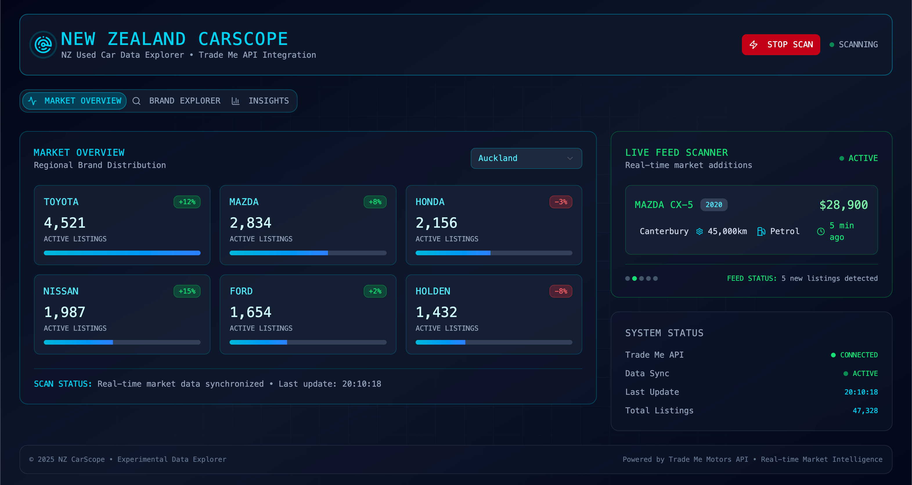

# New Zealand CarScope

Real-time used car market insights powered by Trade Me Motors API

## Live Demo

https://new-zealand-car-scope.vercel.app

## Screenshot



## Features

- **Market Overview** - Real-time brand statistics with regional filtering and pagination
- **Brand Explorer** - Interactive brand and model browser with detailed statistics
- **Market Insights** - Fuel type distribution and price range analysis
- **Live Feed Scanner** - Real-time monitoring of newly listed vehicles
- **Cyberpunk UI** - Modern tech-inspired interface design

## Tech Stack

### Frontend
- React + TypeScript
- Vite
- Tailwind CSS
- Recharts

### Backend
- Node.js + Express
- Trade Me Sandbox API (OAuth 1.0a)
- Node-cache

### Deployment
- Frontend: Vercel
- Backend: Railway

## Local Development

For local development or customization:

### Frontend
```bash
npm install
cp .env.example .env
npm run dev
```

### Backend
```bash
cd server
npm install
cp .env.example .env
npm run dev
```

Configure Trade Me API credentials in `.env` files.

## License

MIT

---

Powered by Trade Me API
